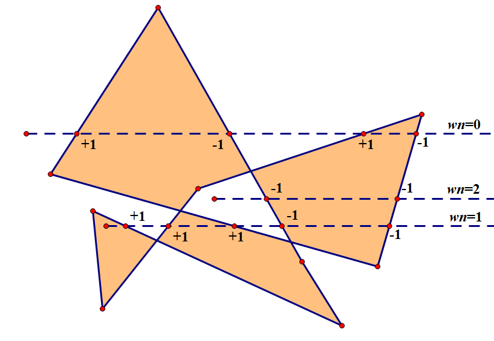

#  Winding-Polygons 

## Course project for CG 2017

## Topic: 
Winding-Polygons - Show how to compute winding numbers of polygonal curve

### Description:
Winding number:
In mathematics, the winding number of a closed curve in the plane around a given point is an integer representing the total number of times that curve travels counterclockwise around the point. The winding number depends on the orientation of the curve, and is negative if the curve travels around the point clockwise.

### Processure:
1. get a polygon
2. set a point 
3. calculate the winding number

## Group member:
* Yenhsiang Lai : yen-hsiang.lai@uconn.edu
* Qi Zhang : qi.3.zhang@uconn.edu
* Yufan Zhang : yufan.zhang@uconn.edu
* Shaoyan He : shaoyan.he@uconn.edu

## Tools:
* ~~JavaScript(Jquery) and HTML5 Canvas~~(this version may generate later)

* Processing

## Algorithm we will use
* method 1

* method 2

